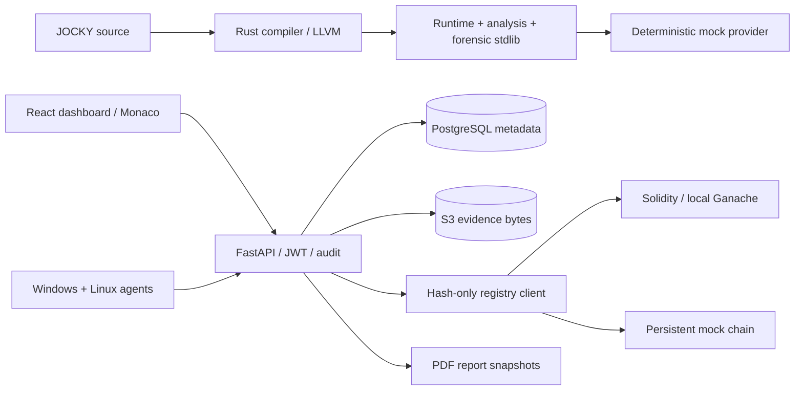

# JOCKY

JOCKY is a defensive digital-forensics programming language and investigation platform. It is designed for authorized collection, triage, malware analysis, and security operations workflows.

This prototype includes:

- A Rust DSL toolchain: lexer, parser, AST, semantic analyzer, IR, runtime, CLI, and LLVM IR generation linked to the runtime.
- A Rust forensic standard library covering system, process, filesystem, network, logs, hashing, timeline, and reporting.
- Cross-platform forensic agent crates and a polling agent executable for Windows and Linux.
- A FastAPI backend with JWT authentication, investigations, agents, jobs, evidence metadata, and report endpoints.
- A React + TypeScript dashboard.
- Docker Compose for PostgreSQL, S3-compatible SeaweedFS storage, backend, agent, and frontend.
- Tests, examples, and documentation.
- Hash-only Solidity registry, persistent mock/Web3 clients, custody history and audit.
- Findings, multi-machine case comparison, mock-only Monaco editor and PDF reports.

## Integrated Architecture



Run `python scripts/demo_e2e.py` for an isolated three-machine tamper demo and
`cargo run -p jocky-cli -- run examples/mock_investigation.jky --mock` for synthetic
compiler output. The demo asserts PC-002 VERIFIED and PC-001 MISMATCH, and writes
`output/pdf/demo-report.pdf`; it never modifies your running workspace.

See [integrated setup](docs/deployment/integrated-prototype.md),
[language specification](docs/language/specification.md),
[API reference](docs/api/backend.md), [integrity model](docs/blockchain/evidence-integrity.md),
[security review](docs/security/threat-model.md), and [production roadmap](ROADMAP.md).
The web editor's BUILD action emits LLVM IR; the CLI builds native executables.
Mock registry results are simulations, not independent blockchain attestations.

## Safety Scope

JOCKY is for authorized defensive security and digital forensics only. The implementation intentionally excludes:

- BYOVD exploitation
- EDR/antivirus bypass or disabling
- Kernel callback disabling
- Process hollowing
- Reflective DLL injection
- API unhooking
- Direct syscall evasion
- Credential theft
- Persistence mechanisms
- Privilege escalation exploits
- Stealth mechanisms
- Domain-fronting for command-and-control
- Malware payload generation
- Destructive actions

The language and runtime expose read-only collection and analysis primitives. Collection APIs should minimize false positives and avoid interfering with security tooling, but must not bypass or disable security controls.

## Quick Start

```bash
docker compose up --build
```

Services:

- Frontend: http://localhost:5173
- Backend API: http://localhost:8000
- API docs: http://localhost:8000/docs
- S3 object store: http://localhost:8333

Default demo login (local development only):

- Email: `analyst@jocky.local`
- Password: `jocky-demo`

The Compose stack starts a Linux agent registered as `demo-agent`. Create an investigation and schedule a supported collection from the Jobs view. Evidence is stored as JSON in the S3-compatible object store with a SHA-256 digest. The API checks the digest when evidence is opened.

This is a prototype. The LLVM backend lowers each investigation and IR operation to calls into the audited Rust runtime. Forensic collectors remain runtime library functions rather than being inlined as platform-specific LLVM instructions. Agent authentication uses a shared development key; production deployments need per-agent credentials, TLS, audited enrollment, and an explicit authorization policy before connecting real endpoints.

## Language Example

```jocky
investigation "Suspicious process triage" {
  target host("localhost")

  collect system.info() as sys
  collect process.list() as processes
  collect network.connections() as connections

  analyze processes where name contains "powershell"
  report "triage-report" {
    include sys
    include processes
    include connections
  }
}
```

Compile to JOCKY IR:

```bash
cargo run -p jocky-cli -- compile examples/system_info.jky
```

Run semantic checks:

```bash
cargo run -p jocky-cli -- check examples/full_investigation.jky
```

Compile and run a native executable with LLVM/Clang:

```bash
cargo run -p jocky-cli -- build examples/stdlib_investigation.jky --output jocky-native
./jocky-native
```

`build` emits sibling `.ll` and object files, compiles the LLVM module with Clang, and lets Cargo link it with the Rust runtime. On Windows, use an `.exe` output path and a Clang/MSVC toolchain. `run` and native binaries execute only a local `host("localhost")` (or matching host name) target; an `agent(...)` target is for the separate backend job path and is rejected by the local CLI.

For file metadata, hashing, or file-based log reads, set `JOCKY_READ_ROOTS` to explicitly authorized directories (platform path-list syntax). Reads outside those roots are rejected. `filesystem` rejects non-regular files and files over 64 MiB; file log output is bounded to 1 MiB and 1,000 lines. OS permissions remain authoritative. The local DSL runtime supports all documented stdlib calls; the remote agent job API currently exposes only system, process, and network collection.

## Repository Map

- `compiler/` - Rust DSL implementation.
- `stdlib/` - Rust forensic APIs and documentation.
- `agent/` - Rust forensic agent crates.
- `backend/` - FastAPI service.
- `frontend/` - React dashboard.
- `examples/` - JOCKY scripts.
- `tests/` - Cross-component test assets.
- `docs/` - Language, architecture, API, and deployment docs.
